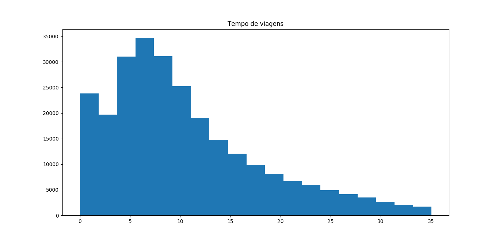

## Prova II – Desenvolvimento de Modelo de Simulação

### Equipe:
- [DANIEL SANTOS SANTANA](@) - 201504940032
- [JAIRO NASCIMENTO DE SOUSA FILHO](@jairofilho79) - 201604940016
- [KELLY DO SOCORRO SILVA DA COSTA](@kellydosocorro) - 201604940040
- [LUCAS GABRIEL DE SOUZA](@souzaluuk) - 201604940039

### Execução
- Clone este repositório:
    ```bash
    [~]$ git clone https://github.com/souzaluuk/SD-209.2.git
    [~]$ cd SD-209.2
    ```
- Instale as bibliotecas nescessárias:
    ```bash
    [SD-209.2]$ pip install -r 
    ```
- Execute o `main.py` e veja se o resultado se assemelha ao seguinte:
    ```bash
    [SD-209.2]$ pyhon main.py
    ```
